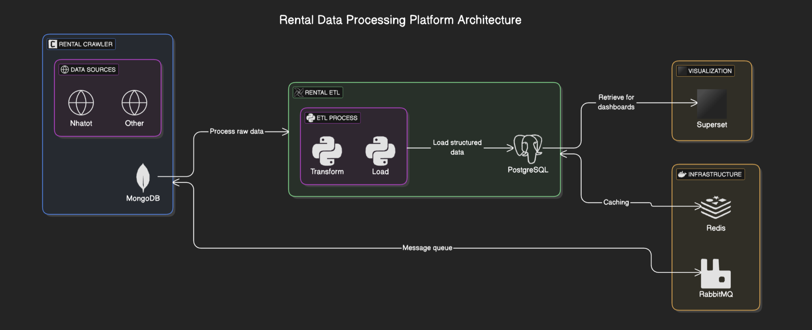
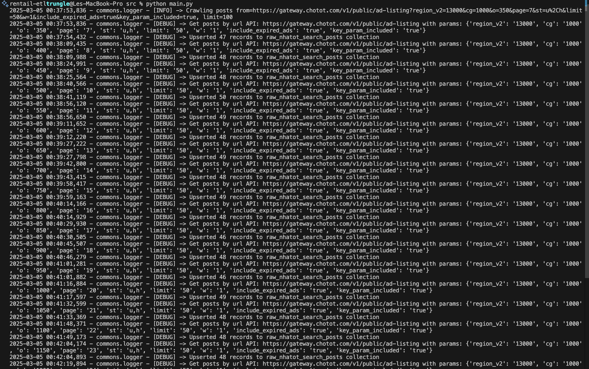
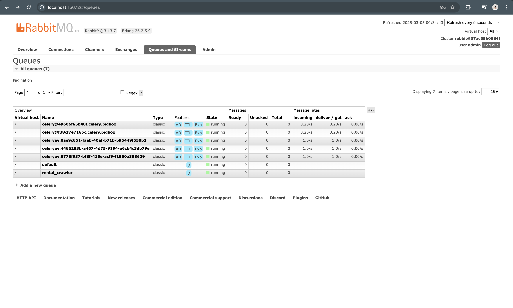
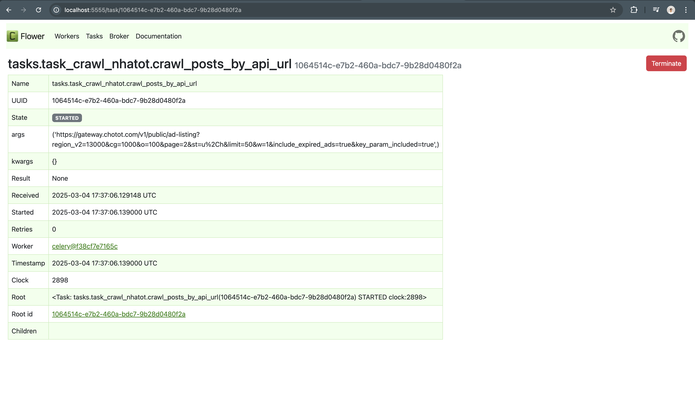
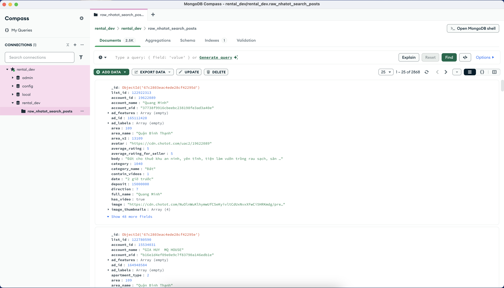
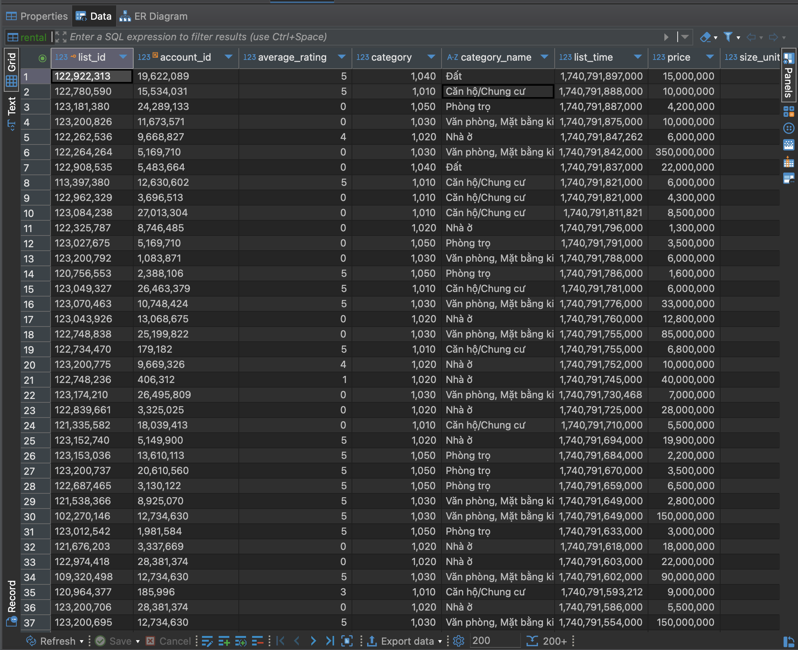
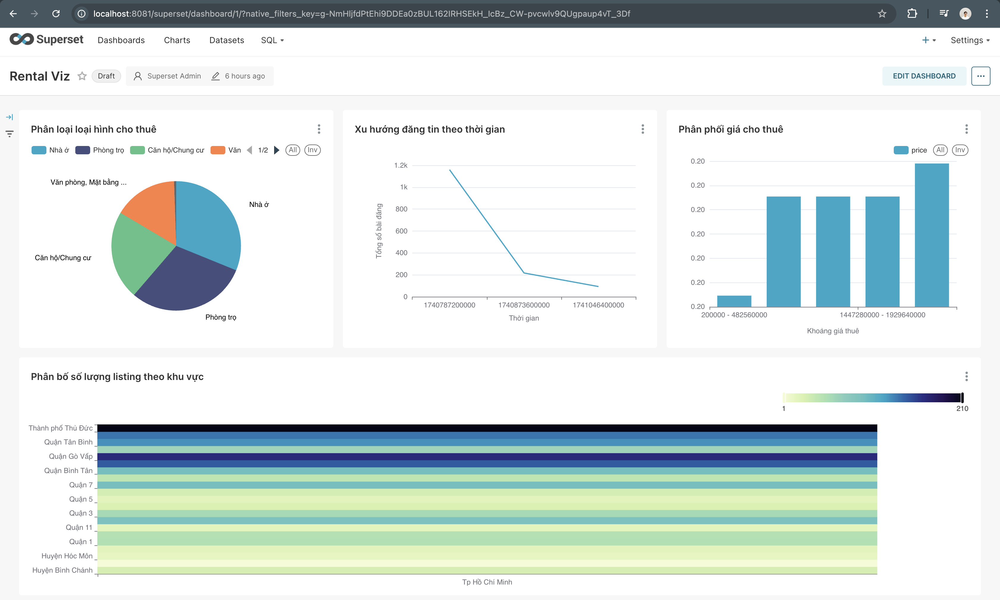

# Rental Data Platform

A comprehensive data platform for collecting, processing, and analyzing rental property listings from multiple Vietnamese sources (Nhatot, etc.). This project demonstrates a modern data engineering stack with production-ready patterns for ETL pipelines.

## Overview

This project aims to:
- Crawl rental data from popular Vietnamese real estate platforms
- Process and transform raw data into clean, structured formats
- Store data in appropriate databases for different access patterns
- Analyze rental trends and insights through dashboards
- Demonstrate best practices in data engineering and ETL processes

## Architecture



The platform consists of two main components:

### 1. rental_crawler
A Celery-based crawler system that extracts rental listings from sources and stores raw data in MongoDB.

### 2. rental_etl
An Airflow-powered ETL system that processes raw data from MongoDB, transforms it, and loads it into a PostgreSQL data warehouse for analysis.

## Tech Stack

- **Data Collection**: Python, Requests, Beautiful Soup
- **Processing**: Celery, Airflow, Python
- **Storage**: MongoDB (raw data), PostgreSQL (data warehouse)
- **Message Queue**: RabbitMQ
- **Caching**: Redis
- **Visualization**: Apache Superset
- **Infrastructure**: Docker, Docker Compose

## Project Structure

```
rental-etl-platform/
│
├── rental_crawler/               # Data collection system
│   ├── src/
│   │   ├── commons/              # Shared utilities
│   │   │   ├── celery.py         # Celery configuration
│   │   │   └── ...
│   │   ├── config/               # Configuration settings
│   │   ├── crawlers/             # Source-specific crawlers
│   │   │   ├── nhatot_crawler.py # Nhatot website crawler
│   │   │   └── ...
│   │   ├── etl/                  # ETL modules for crawler
│   │   │   ├── nhatot_etl.py     # Nhatot ETL logic
│   │   │   └── ...
│   │   ├── models/               # Data models
│   │   └── tasks/                # Celery task definitions
│   │       ├── task_crawl_nhatot.py
│   │       └── ...
│   ├── Dockerfile
│   └── requirements.txt
│
├── rental_etl/                   # Data processing system
│   ├── dags/                     # Airflow DAG definitions
│   │   ├── etl_posts_nhatot_to_dwh.py
│   │   └── ...
│   ├── scripts/                  # Utility scripts
│   │   ├── commons/              # Common utilities
│   │   ├── config/               # Configuration
│   │   ├── database/             # Database connectors
│   │   └── helpers/              # Helper functions
│   ├── Dockerfile
│   └── requirements.txt
│
├── init.sql                      # Database initialization
├── docker-compose.yml            # Docker Compose config
└── README.md                     # This file
```

## Features

- **Scheduled Data Collection**: Automatically crawls rental listings from sources on a defined schedule
- **Data Deduplication**: Ensures no duplicate listings are stored
- **Data Transformation**: Cleans, normalizes, and enriches data
- **Data Warehousing**: Structured storage for analysis
- **Monitoring & Logging**: Comprehensive monitoring of pipeline health
- **Visualization**: Dashboards to analyze rental market trends

## Installation & Setup

### Prerequisites

- Docker and Docker Compose
- Git

### Steps to Run

1. Clone the repository:
```bash
git clone https://github.com/ldtrungmark/rental-etl-platform.git
cd rental-etl-platform
```

2. Configure environment variables:

To have the system send notifications when the crawl task fails, you need to set up a Telegram BOT and then assign it to `docker.env` before building.

```bash
# Edit docker.env file with your configurations
source docker.env
```

3. Start the services:
```bash
docker-compose up -d
```

4. Access the services:
- Airflow: http://localhost:8080 (Username: airflow, Password: airflow)
- Superset: http://localhost:8081 (Username: admin, Password: admin)
- Flower (Celery monitoring): http://localhost:5555

## Usage

### Running a Crawler

### Local run
```bash
# Create .env
python -m venv .venv
source .venv

# Run test local
source local.env
cd rental_crawler/src
python main.py
```


### Run in container crawler_worker
Crawlers are scheduled to run automatically, but you can also trigger them manually:

```bash
docker-compose exec crawler_worker celery -A commons.celery_app call \
  rental_crawler.src.tasks.task_crawl_nhatot.crawl_posts_by_api_url \
  --args='["https://api.example.com/endpoint", 100]'
```

### Triggering ETL Pipelines

ETL pipelines run on a scheduled basis in Airflow. To manually trigger:

1. Access the Airflow UI
2. Navigate to DAGs
3. Find `etl_posts_nhatot_to_dwh` DAG
4. Click "Trigger DAG"

## Sample Results

RabbitMQ


Flower


MongoDB


PostgreSQL


Dashboard


## Development

### Adding a New Data Source

1. Create a new crawler in crawlers
2. Define Celery tasks in tasks
3. Create a new ETL DAG in dags

## License

This project is licensed under the MIT License - see the LICENSE file for details.

## Acknowledgments

- Built with insights from various data engineering best practices
- Special thanks to the open-source community for providing the tools that made this possible

---

*Note: This project is for educational purposes and personal learning. It is not affiliated with any of the websites it crawls data from.*